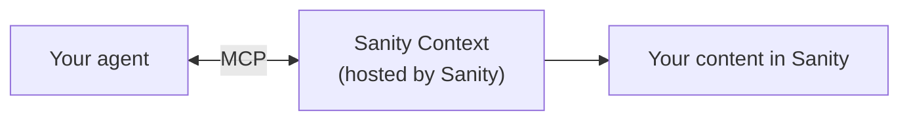

# Sanity Context

Give AI agents structured access to your content. The Sanity Context MCP server is a hosted [MCP](https://modelcontextprotocol.io/) endpoint that connects AI agents to your [Sanity Content Lake](https://www.sanity.io/content-lake), where content is stored as structured, queryable data (not pages or blobs of HTML).

Instead of vectorizing your content into embeddings and hoping similarity search returns the right answer, Sanity Context lets agents query your actual data model: filter by fields, traverse references between documents, and combine structured queries with semantic search. Embeddings for exploration, structured queries for precision.

[Read the full documentation →](https://www.sanity.io/docs/ai/sanity-context)

> **Sanity Context vs Sanity MCP Server** — Sanity offers two MCP endpoints. The [Sanity MCP Server](https://www.sanity.io/docs/ai/mcp-server) gives AI coding assistants like Cursor, Claude Code, and v0 full access to your Sanity workspace (content, schemas, releases, and more). Sanity Context is different: it's for **production agents that serve your end users** — read-only, scoped access you use to power search, support bots, and other content-driven features in your application.

## How it works



You create a Sanity Context document in [Sanity Studio](https://www.sanity.io/studio). This document controls what content your agent can access and generates a unique MCP URL. Your agent connects to that URL with an API token.

The Sanity Context MCP server exposes three tools:

| Tool              | What it does                                                                       |
| ----------------- | ---------------------------------------------------------------------------------- |
| `initial_context` | Returns a compressed schema overview: content types, fields, and document counts   |
| `groq_query`      | Runs [GROQ](https://www.sanity.io/docs/groq) queries with optional semantic search |
| `schema_explorer` | Returns the full schema for a specific content type                                |

With these tools, your agent can:

- Look up exact prices, inventory, or metadata (not approximate text matches)
- Filter products by category, size, color, or any field in your schema
- Follow references between documents (a product's brand, a brand's products)
- Combine structured filters with semantic search ("trail running shoes under $150")

Here's a combined query in GROQ:

```groq
*[_type == "product" && category == "shoes"]
  | score(text::semanticSimilarity("lightweight trail runner for rocky terrain"))
  | order(_score desc)
  { _id, title, price, category }[0...5]
```

Structural filter (`category == "shoes"`) for precision. Semantic ranking (`text::semanticSimilarity()`) for discovery.

## Get started

### Prerequisites

- A [Sanity](https://www.sanity.io/) project with content and a [deployed Studio](https://www.sanity.io/docs/deployment) (v5.1.0+)
- A **Sanity API read token** — create one at [sanity.io/manage](https://sanity.io/manage) (Project → API → Tokens) or via CLI:
  ```bash
  npx sanity tokens add "Sanity Context" --role=viewer
  ```
- An **LLM API key** (Anthropic, OpenAI, or another provider)

New to Sanity? [Start here](https://www.sanity.io/docs/getting-started).

### Using skills

If you're using Claude Code, Cursor, or similar, you can install skills that guide your AI assistant through the setup:

```bash
npx skills add sanity-io/context --all
```

Then prompt:

```
Use the create-agent-with-sanity-context skill to help me build an agent.
```

The skill walks you through Studio setup, MCP connection, and configuration for your stack (Next.js, SvelteKit, Express, Python, etc).

Other skills help you refine: `dial-your-context` (tune the Instructions field) and `shape-your-agent` (craft a system prompt).

### Manual setup

1. Install the Studio plugin:

   ```bash
   npm install @sanity/context
   ```

   ```ts
   // sanity.config.ts
   import {defineConfig} from 'sanity'
   import {contextPlugin} from '@sanity/context/studio'

   export default defineConfig({
     // ...existing config
     plugins: [contextPlugin()],
   })
   ```

2. Create a Sanity Context document in Studio and copy the MCP URL.

3. Connect your agent using any MCP-compatible framework. Example with [Vercel AI SDK](https://sdk.vercel.ai/):

   ```ts
   import {createMCPClient} from '@ai-sdk/mcp'

   const mcpClient = await createMCPClient({
     transport: {
       type: 'http',
       url: process.env.SANITY_CONTEXT_MCP_URL,
       headers: {
         Authorization: `Bearer ${process.env.SANITY_API_READ_TOKEN}`,
       },
     },
   })
   ```

## Agent Insights

Track and analyze your agent conversations with built-in telemetry:

- Automatic conversation saving via AI SDK integration
- AI-powered classification (success score, sentiment, content gaps)
- Studio dashboard for analytics and conversation browsing

See the [package documentation](./packages/context#agent-insights) for setup.

## Troubleshooting

**Validate the connection** — Test that your token and endpoint work:

```bash
curl -X POST https://api.sanity.io/v2026-03-03/context/mcp/:projectId/:dataset/:slug \
  -H "Authorization: Bearer $SANITY_API_READ_TOKEN" \
  -H "Content-Type: application/json" \
  -d '{"jsonrpc": "2.0", "method": "tools/list", "id": 1}'
```

If this returns a list of tools, you're connected. The full MCP URL is shown in your Sanity Context document in Studio.

**401 Unauthorized** — Your `SANITY_API_READ_TOKEN` is missing or invalid. Generate a new token at [sanity.io/manage](https://sanity.io/manage) → Project → API → Tokens.

**No schema or empty results** — Sanity Context requires a deployed Studio. Run `npx sanity deploy`. If you've set a content filter, ensure it matches published documents.

**Tools not appearing** — Verify the MCP URL is correct (project ID, dataset, slug) and that the Sanity Context document is published.

## Learn more

- [Sanity Context documentation](https://www.sanity.io/docs/ai/sanity-context)
- [Dataset embeddings](https://www.sanity.io/docs/content-lake/dataset-embeddings)
- [How to serve content to agents (field guide)](https://www.sanity.io/blog/how-to-serve-content-to-agents-a-field-guide)
- [What is GROQ?](https://www.sanity.io/docs/groq)
- [Content Lake](https://www.sanity.io/content-lake)
- [Sanity Studio](https://www.sanity.io/studio)
- [Model Context Protocol](https://modelcontextprotocol.io/)
