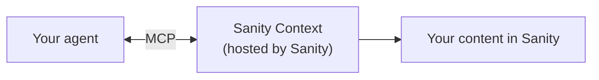

# Sanity Context

Give AI agents structured access to your content. The Sanity Context MCP server is a hosted [MCP](https://modelcontextprotocol.io/) endpoint that connects AI agents to your [Sanity Content Lake](https://www.sanity.io/content-lake), where content is stored as structured, queryable data (not pages or blobs of HTML).

Instead of vectorizing your content into embeddings and hoping similarity search returns the right answer, Sanity Context lets agents query your actual data model: filter by fields, traverse references between documents, and combine structured queries with semantic search. Embeddings for exploration, structured queries for precision.

[Read the full documentation →](https://www.sanity.io/docs/ai/sanity-context)

> **Sanity Context vs Sanity MCP Server** — Sanity offers two MCP endpoints. The [Sanity MCP Server](https://www.sanity.io/docs/ai/mcp-server) gives AI coding assistants like Cursor, Claude Code, and v0 full access to your Sanity workspace (content, schemas, releases, and more). Sanity Context is different: it's for **production agents that serve your end users** — read-only, scoped access you use to power search, support bots, and other content-driven features in your application.

## How it works


```mermaid
flowchart LR
  A["Your agent"] <-->|"MCP"| B["Sanity Context <br> (hosted by Sanity)"]
  B --> C["Your content in Sanity"]
```

You create an MCP endpoint in the Context app in the [Sanity Dashboard](https://www.sanity.io/docs/dashboard). The endpoint controls what content your agent can access and gets its own MCP URL. Your agent connects to that URL with an organization API token. An endpoint serves either your live dataset (GROQ mode) or [Knowledge Bases](https://www.sanity.io/docs/ai/sanity-context-knowledge-bases) built ahead of time from datasets, websites, and files (Knowledge Base mode, beta).

In GROQ mode, the Sanity Context MCP server exposes these tools (Knowledge Base mode serves `initial_context` and `knowledge_base_read` instead):

| Tool                 | What it does                                                                       |
| -------------------- | ---------------------------------------------------------------------------------- |
| `initial_context`    | Returns a compressed schema overview: content types, fields, and document counts   |
| `groq_query`         | Runs [GROQ](https://www.sanity.io/docs/groq) queries with optional semantic search |
| `schema_explorer`    | Returns the full schema for a specific content type                                |
| `array_field_reader` | Reads large array fields and Portable Text content from a single document          |

With these tools, your agent can:

- Look up exact prices, inventory, or metadata (not approximate text matches)
- Filter products by category, size, color, or any field in your schema
- Follow references between documents (a product's brand, a brand's products)
- Combine structured filters with semantic search ("trail running shoes under $150")

Here's a combined query in GROQ:

```groq
*[_type == "product" && category == "shoes"]
  | score(text::semanticSimilarity("lightweight trail runner for rocky terrain"))
  | order(_score desc)
  { _id, title, price, category }[0...5]
```

Structural filter (`category == "shoes"`) for precision. Semantic ranking (`text::semanticSimilarity()`) for discovery.

## Get started

### Prerequisites

- **Context enabled** for your organization. An organization admin can enable it from the organization's [Labs page](https://www.sanity.io/manage/org/labs) in Manage
- For GROQ mode: a [Sanity](https://www.sanity.io/) project with content and a **deployed schema** from Studio v5.1.0 or later (`npx sanity schema deploy`). For Knowledge Base mode: a built Knowledge Base
- An **organization API token** with Context permissions, created in [Manage](https://www.sanity.io/manage/org/api/tokens) under your organization's API > Tokens. Choose **Viewer** for an agent that only reads, or **Editor** if it also records [Insights](#agent-insights). Project tokens don't work. Keep the token server-side
- An **LLM API key** (Anthropic, OpenAI, or another provider)

New to Sanity? [Start here](https://www.sanity.io/docs/getting-started).

### Using skills

If you're using Claude Code, Cursor, or similar, you can install skills that guide your AI assistant through the setup:

```bash
npx skills add sanity-io/context --all
```

Then prompt:

```
Use the create-agent-with-sanity-context skill to help me build an agent.
```

The skill walks you through creating the MCP endpoint, connecting your agent, and configuration for your stack (Next.js, SvelteKit, Express, Python, etc).

Other skills help you refine: `dial-your-context` (tune the Instructions field) and `shape-your-agent` (craft a system prompt).

### Manual setup

1. Open the Context app in the [Sanity Dashboard](https://www.sanity.io/docs/dashboard), create an MCP endpoint with your dataset as its source, and copy the MCP URL. It looks like `https://api.sanity.io/v1/context/organizations/:organizationId/mcp/:endpointName`.

2. Connect your agent using any MCP-compatible framework. Example with [Vercel AI SDK](https://sdk.vercel.ai/):

   ```ts
   import {createMCPClient} from '@ai-sdk/mcp'

   const mcpClient = await createMCPClient({
     transport: {
       type: 'http',
       url: process.env.SANITY_CONTEXT_MCP_URL,
       headers: {
         Authorization: `Bearer ${process.env.SANITY_ORGANIZATION_TOKEN}`,
       },
     },
   })
   ```

### Legacy: Studio plugin

> **Deprecated:** Configuration for new setups happens in the Context app. The Studio plugin still works for editing existing Sanity Context documents. See the [migration guide](https://www.sanity.io/docs/ai/context-migration-guide).

If you have an existing Sanity Context document, install the plugin to keep editing it in Studio:

```bash
npm install @sanity/context
```

```ts
// sanity.config.ts
import {defineConfig} from 'sanity'
import {contextPlugin} from '@sanity/context/studio'

export default defineConfig({
  // ...existing config
  plugins: [contextPlugin()],
})
```

## Agent Insights

Track and analyze your agent conversations with built-in telemetry:

- Automatic conversation saving via AI SDK integration
- AI-powered classification (success score, sentiment, content gaps)
- Analytics and conversation browsing in the Context app

Recording conversations needs an organization token with Context **Editor** permissions.

See the [package documentation](./packages/context#agent-insights) for setup.

## Troubleshooting

**Validate the connection** — Test that your token and endpoint work:

```bash
curl -X POST https://api.sanity.io/v1/context/organizations/:organizationId/mcp/:endpointName \
  -H "Authorization: Bearer $SANITY_ORGANIZATION_TOKEN" \
  -H "Accept: application/json, text/event-stream" \
  -H "Content-Type: application/json" \
  -d '{"jsonrpc": "2.0", "method": "tools/list", "id": 1}'
```

If this returns a list of tools, you're connected. The full MCP URL is shown on the endpoint in the Context app.

**401 Unauthorized** — The token is missing or malformed, or it belongs to a different organization than the one in the URL. Check that it's sent as `Authorization: Bearer <token>` and that the organization ID is right.

**403 Forbidden (JSON-RPC `-32007`, `contextGrantRequired`)** — The token isn't an organization API token with Context permissions. Project tokens are refused. Create one in [Manage](https://www.sanity.io/manage/org/api/tokens) under your organization's API > Tokens.

**"Only datasets with deployed Studio applications are supported"** — The schema isn't deployed for the endpoint's project and dataset. Run `npx sanity schema deploy` from a Studio on v5.1.0 or later.

**Empty results** — If the endpoint has a GROQ filter, check that it matches published documents. A filter that matches nothing looks like a broken connection.

**Tools not appearing** — Verify the MCP URL is correct (organization ID and endpoint name) If you expect the GROQ tools, check that the endpoint's content source is a dataset; Knowledge Base endpoints serve different tools.

## Learn more

- [Sanity Context documentation](https://www.sanity.io/docs/ai/sanity-context)
- [Dataset embeddings](https://www.sanity.io/docs/content-lake/dataset-embeddings)
- [How to serve content to agents (field guide)](https://www.sanity.io/blog/how-to-serve-content-to-agents-a-field-guide)
- [What is GROQ?](https://www.sanity.io/docs/groq)
- [Content Lake](https://www.sanity.io/content-lake)
- [Sanity Studio](https://www.sanity.io/studio)
- [Model Context Protocol](https://modelcontextprotocol.io/)
